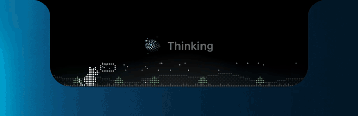

# Agent Island

**English** ｜ [繁體中文](README.zh-TW.md)

<p align="center"></p>

See what your AI agent (Claude Code or Codex) is doing at a glance, right in your MacBook's notch.

It stays tucked into the notch when idle. When Claude Code starts working, it grows out of the notch and shows the file being read, the command being run and the tokens generated this turn, with a pixel cat below acting out each state. When the work is done, it shrinks back into the notch.

## Install

1. Download the latest `Agent-Island-x.y.z.zip` from [Releases](https://github.com/1413jean/agent-island/releases), unzip it and drag **Agent Island.app** into Applications.
2. First launch: right-click the app → **Open** → **Open** again. The app isn't notarized by Apple, so macOS warns that it can't verify the developer the first time; after that it opens normally.
3. The app opens the **Connections** page in Settings. Click **Connect…**. Restart any Claude Code session that's already open and it will start showing up.

Requires macOS 14 or later, on Apple silicon or Intel. The hook runs with macOS's `python3` (already there if you've installed git; if not, macOS asks you to install the Command Line Tools the first time).

It checks for updates every hour (via [Sparkle](https://sparkle-project.org)). When a new version is out, an **Update** button shows up at the top of Settings and in the menu. Click it to see what's new and install; the app relaunches by itself. Every update is signed, and the app won't install one whose signature doesn't match. Turn automatic checks off in Settings → About.

## What you'll see on the island

| State | When | What the cat does |
| --- | --- | --- |
| Thinking | After you send a prompt, and between tools | Sits and thinks, with a "…" bubble |
| Reading / Searching | Read, Grep, Glob, WebFetch | Strolls along |
| Editing / Writing | Edit, Write, Agent | Bats a ball of yarn |
| Running command | Bash | Runs at full speed while the scenery scrolls |
| Done | The reply is finished | Hops twice, sits down and shows a heart |
| Paused | You pressed Esc, or cancelled right after sending (detected after a few silent seconds) | Stretches |
| Usage limit reached | You're out of usage; shows when it resets | Lies flat on the ground |
| Login required / Connection lost… | Sign-in expired, network down and other API errors; shows the cause and what to do | Arches its back in fright |
| Stopped / Ready | Session ended / nothing running | Curls up and sleeps |

The icon next to the state comes in two styles, **Orb** (a 3D dotted sphere of light) and **Pixel** (a 5×5 dot animation), with the same colors: blue while working, white when idle, green when done, red on errors.

- **Multiple tasks**: with several Claude Code sessions open, hover over the island and swipe left or right with two fingers on the trackpad.
- **Right-click**: right-click the island to dismiss the current task.
- **Moves aside on hover**: move the mouse over the expanded island and it shrinks back into the notch so you can click what's underneath.
- **Multiple displays**: touch the top edge of another display with the mouse and the island moves there.
- **Codex**: if you also use Codex, its tasks show up on the island too (it reads the logs in `~/.codex/sessions`; nothing to set up).
- **Done notification and sound**: when a task finishes you get a system notification (click it to return to that Terminal tab) and a sound, which you can change.

## Settings

Menu bar cat icon → **Settings…** (⌘,):

| Page | What's there |
| --- | --- |
| General | Language (Auto / 中文 / English), launch at login, display mode (auto / always / on hover), multiple displays, move aside on hover, auto-pause when nothing happens after sending, reset appearance |
| Connections | Connect / disconnect Claude Code; also show Codex tasks (reads Codex's own logs, no setup) |
| Notifications | Pop up when a task ends, system notifications, done sound |
| Appearance | What to show (detail, state text, token count; turn all off for the smallest island), icon style, cat scene, bottom glow, font sizes |
| Size & Frame | Width, padding, line spacing, notch curve, corner radius, bounce |
| About | Version, check for updates, third-party licenses, quit |

Menu bar icon → **Quit** (⌘Q) closes it; open it again from Applications or Spotlight. Opening the app again while it's running brings up Settings.

## How it works

```
Claude Code hook ──> island_hook.py (bundled in the app) ──> ~/.claude/tools/island/sessions/<session_id>.json
                                                                              │
                                        Agent Island (reads every 0.15 s) <──┘
```

- **Connect** adds one hook each to `UserPromptSubmit`, `PreToolUse`, `PostToolUse`, `Stop`, `SessionEnd` and `Notification` (`idle_prompt`) in `~/.claude/settings.json`, touching only its own entries. It backs the file up to `settings.json.agent-island-backup` before writing.
- Interruptions, usage limits, API errors and token counts are read by the app straight from Claude Code's transcript.
- Appearance settings are stored in `~/.claude/tools/island/tuning.json`.

## Privacy

- **Nothing leaves your Mac.** The island only reads local files: the state files written by the Claude Code hook, Claude Code's transcripts and Codex's logs. Everything is processed on your machine.
- **No tokens spent, no AI calls.** Everything it shows comes from the files above.
- **The only network access is the update check**: once an hour it reads the public update list (`appcast.xml`) from GitHub Releases and sends nothing. You can turn it off in Settings → About.
- **Only two places are ever modified**: `~/.claude/settings.json` when you click Connect (it only adds the island's own hooks, after a backup), and the island's own settings in `~/.claude/tools/island/`.

## Development

```sh
./build.sh                           # test build: build, install to ~/Applications, relaunch
./release.sh 1.1.0 "What's new"      # bump version, zip, sign, write appcast.xml, tag, upload to GitHub Releases
```

`build.sh` makes a **test build** (demo mode for screen recordings, no auto-update); `release.sh` makes the **release build** everyone downloads. Releases are signed with a Sparkle EdDSA key stored in the publisher's Keychain (account `agent-island`); `scripts/fetch-sparkle.sh` downloads a pinned Sparkle into `vendor/`. `scripts/bundle.sh` packs the binary, hook and sounds into the `.app`; both scripts above use it.

## License

Agent Island is released under the [MIT License](LICENSE): you're free to use, modify and share it, as long as you keep the copyright and license notice.

Open-source components it uses, and their notices, are listed in `THIRD_PARTY_NOTICES.md` (in the app: Settings → About → Third-party licenses…).
